# Perceptually uniform colormaps for MATLAB

**NOTE**: All rights to the original authors. For licensing see information for individual sources in [Colormap sources](#colormap-sources). Custom colormaps new to this work are released under a [MIT License](https://opensource.org/licenses/MIT).

---

This repository contains files for colormaps, mostly compiled from multiple, external sources (see [dedicated section below](#colormap-sources)), with some _custom_ colormaps that are specific to this package. After making a copy of the folder locally, the next step in their use is to add the parent folder to the sample project, e.g., 

```Matlab
addpath cmap; % add cmap folder to the MATLAB path
```

Then colormaps can be loaded by calling the functions that share their name. For example, you can get the color data for the viridis colormap using,

```Matlab
cm = viridis; % return colormap data to cm
```

or apply it to a plot using

```Matlab
colormap(viridis); % apply viridis to a plot
```

Optional arguments to these functions allow for changing the number of colors in the colormap. For example, getting the 100-color equivalent of viridis,

```Matlab
viridis(100); % interpolate to 100 colors in RGB space
```

By default, this will use linear interpolation in RGB space. Alternatively, interpolation can be done in HSV space by appending `'hsv'` as an additional argument:

```Matlab
viridis(100, 'hsv'); % interpolate to 100 colors in HSV space
```

Note that the _deep_, _dense_, _matter_, and _tempo_ colormaps are reversed from their original order, such that the darker color is always first. The colormaps, and swages indicating their color progression, are included at the end of this README.

## Colormap sources

Sources of these colormaps include:

### matplotlib

Colormaps designed by Stéfan van der Walt (https://github.com/stefanv) and Nathaniel Smith (https://github.com/njsmith). More information is available at https://bids.github.io/colormap/. Released under a [CCO license](https://creativecommons.org/about/cc0). You can learn more about the science behind the creation of these kinds of colormaps by watching their presentation of viridis: https://youtu.be/xAoljeRJ3lU. The cividis colormap is a variant of ‘viridis’ developed by Jamie R. Nuñez, Christopher R. Anderton, and Ryan S. Renslow.

### cmocean

More information is available at https://matplotlib.org/cmocean/. Released under a [MIT license](https://opensource.org/licenses/MIT). The colormaps are associated with: Kristen M. Thyng, Chad A. Greene, Robert D. Hetland, Heather M. Zimmerle, and Steven F. DiMarco. True colors of oceanography: Guidelines for effective and accurate colormap selection. Oceanography, September 2016. http://dx.doi.org/10.5670/oceanog.2016.66.

### colorbrewer

Colormaps by Cynthia Brewer and Mark Harrower. More information available at http://colorbrewer2.org/. Released under an [Apache License](https://www.apache.org/licenses/LICENSE-2.0.txt). For diverging colormaps, the order of colors was made consistent with the colormap names. For sequential colormaps, orders were adjusted such that darkest colors appear first. Original colormaps can be restored by using MATLAB's built-in `flipud(...)` function of the altered colormaps.

### cmasher

A collection of scientific colormaps for making accessible, informative and _cmashing_ plots in Python. More information is available at https://github.com/1313e/CMasher and https://cmasher.readthedocs.io/. Released under a [BSD 3-Clause License](https://github.com/1313e/CMasher/blob/master/LICENSE).

### turbo

A. Mikhailov. Turbo, An Improved Rainbow Colormap for Visualization. More information is available at https://ai.googleblog.com/2019/08/turbo-improved-rainbow-colormap-for.html. Released under an [Apache License](https://www.apache.org/licenses/LICENSE-2.0.txt).

### seaborn

Originally for Python by [Michael Waskom](https://mwaskom.github.io/). For supporting discussion see README at https://github.com/mwaskom/seaborn and https://seaborn.pydata.org/tutorial/color_palettes.html. Released under a [BSD 3-Clause License](https://github.com/mwaskom/seaborn/blob/master/LICENSE).

### scientific

A set of scientific colour maps by [Fabio Crameri](https://www.fabiocrameri.ch/colourmaps/). Released under an [MIT License](https://opensource.org/licenses/MIT). Citable at:

> Crameri, F. (2018). Scientific colour maps. Zenodo. http://doi.org/10.5281/zenodo.1243862

### custom

A set of custom colormaps specific to this package. The custom colormaps are only approximately perceptually uniform.

### Other resources

A catalogue of colormaps for Julia can be found here: [Catalogue of ColorSchemes](https://juliagraphics.github.io/ColorSchemes.jl/stable/catalogue).

## Sweep through colormap

The `cmap_sweep(n, cm)` function is also included to sweep through colours in a standard MATLAB plot. To demonstrate we first generate some synthetic data with a set number of lines:

```Matlab
n_lines = 40; % number of lines to plot

addpath supplement; % add supplemental functions / scripts

% generate test data
y = test_data(round(n_lines*2.5), 300);
y = y(:, 1:n_lines);
```

Then, one can sweep through the viridis colormap using:

```Matlab
figure(1);
cmap_sweep(n_lines, inferno); % set colororder for plot
plot(y); % plot data
```

A sample plot generated using this procedure (Sipkens et al., Submitted):

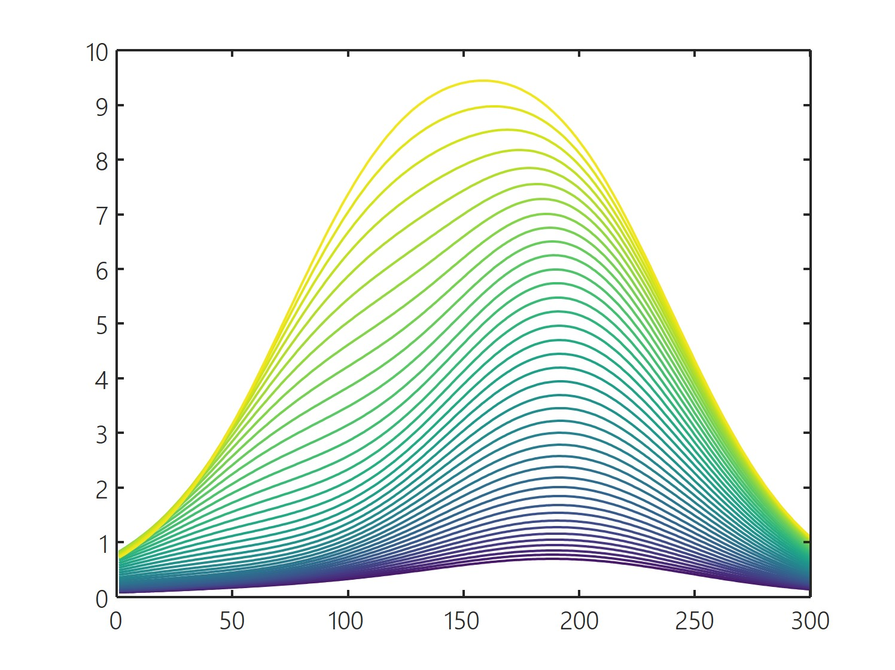

# Catalogue

## Sequential colormaps

Sequential colormaps have a monotonic change in perceived brightness. Colormaps consistently proceed from the darkest to the lightest colour.

### matplotlib

 _cividis_

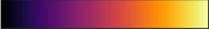 _inferno_

 _magma_

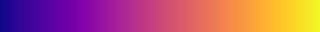 _plasma_

 _viridis_

### cmocean

 _deep_

 _dense_

 _haline_

 _oxy_

 _ice_

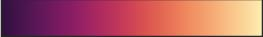 _matter_

 _speed_

 _tempo_

 _thermal_

### colorbrewer

 _blues_

 _bupu_

 _gnbu_

 _greens_

 _pugnbu_

 _purd_

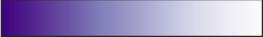 _purples_

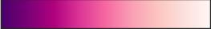 _rdpu_

 _reds_

 _ylgnbu_

### cmasher

 _eclipse_

 _ember_

 _lavender_

 _nuclear_

 _ocean_

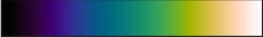 _rainforest_

### seaborn

 _crest_

 _flare_

 _mako_

 _rocket_

### scientific

 _acton_

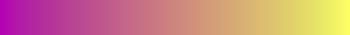 _buda_

 _devon_

 _hawaii_

 _imola_

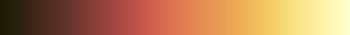 _lajolla_

 _oslo_

 _tokyo_

### custom

 _fblue_

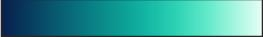 _fgreen_

 _fred_

 _fpurple_

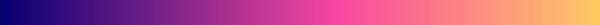 _internet_

 _fmviz_

## Divergent colormaps

Divergent colormaps have the brightest or darkest color in the middle, with a monotonic change in perceived brightness in either direction. Note that the colorbrewer colormaps are in the order of the characters (for example, _RdBu_ starts with red and goes to blue). The _balance_ colormap from cmocean has been renamed to _balanced_, to avoid a name conflict with a native MATLAB function.

### cmocean

 _balanced_

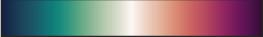 _curl_

 _delta_

### colorbrewer

 _brbg_

 _rdbu_

 _rdylgn_

 _piyg_

 _prgn_

 _puor_

 _spectral_

### scientific

 _cork_

 _roma_

 _vik_

### custom

 _weather_

### turbo

 _turbo_

## Cyclic colormaps

These colormaps start and end with the same colour.

### scientific

 _bamo_

 _corko_

 _romao_

 _viko_
